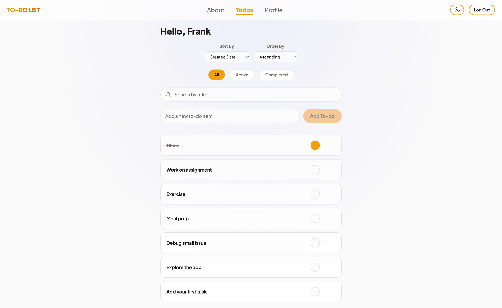
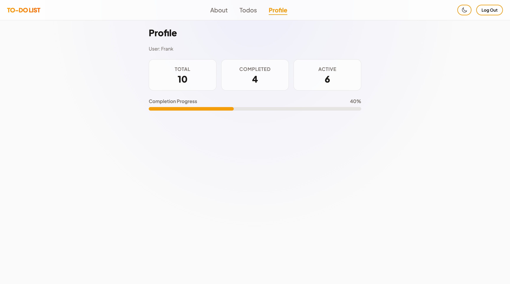
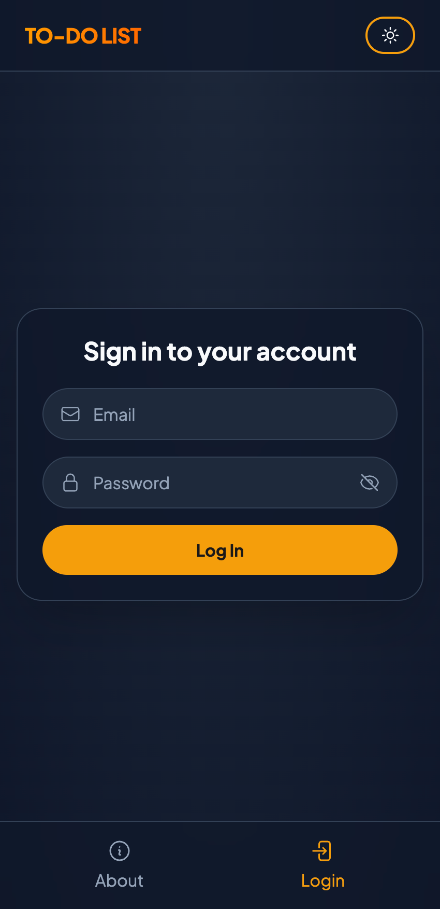
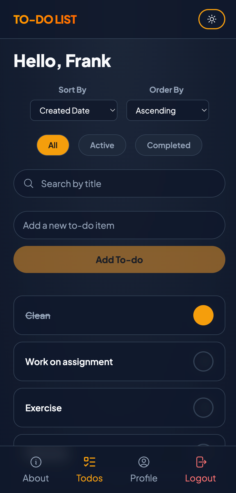

# Todo List App

A todo app I built with React 19 as part of my full-stack development coursework. It started as a simple CRUD app and grew into something I'm genuinely proud of, with a glassmorphism UI, dark/light mode, protected routes, and mobile swipe gestures.

## Live Demo

[Live Demo]()

---

## Screenshots

### Desktop

| Todos Page            | Profile Page |
|-----------------------|--------------|
|  |  |

### Mobile

| Login Page    | Todos Page |
|---------------|------------|
|  |  |

---

## Features

- Add, edit, and delete todos
- Mark todos as complete or incomplete
- Filter by status (All, Active, Completed)
- Sort by created date or title
- Search with debounced input so it doesn't spam the API
- Swipe to delete on mobile
- Hover to reveal delete button on desktop
- Dark/light mode toggle that saves your preference
- Protected routes that redirect you to login if you're not authenticated
- Status filter state lives in the URL so you can share or bookmark filtered views
- Input sanitization with DOMPurify
- Fully responsive with a bottom nav bar on mobile
- Accessible with ARIA labels, live regions, and keyboard navigation

---

## Technologies Used

| Category | Technology |
|----------|------------|
| UI Library | React 19 |
| Routing | React Router 7 |
| Styling | Tailwind CSS v4 |
| Build Tool | Vite 8 |
| Input Sanitization | DOMPurify |
| Deployment | Vercel |

---

## Getting Started

### Prerequisites

- Node.js v18 or higher
- npm v9 or higher

### Installation

1. Clone the repo:
   ```bash
   git clone https://github.com/frankangel-dev/todo-list.git
   cd todo-list
   ```

2. Install dependencies:
   ```bash
   npm install
   ```

3. Start the dev server:
   ```bash
   npm run dev
   ```

4. Open [http://localhost:5173](http://localhost:5173) in your browser.

---

## Available Scripts

| Script | Description |
|--------|-------------|
| `npm run dev` | Starts the dev server at `http://localhost:5173` |
| `npm run build` | Builds for production into the `dist` folder |
| `npm run preview` | Previews the production build locally |
| `npm run lint` | Runs ESLint |

---

## Design Decisions

**Glassmorphism UI:** I wanted the app to look different from a typical todo app. Cards, inputs, and the nav all have blur with semi-transparent backgrounds so the page background bleeds through slightly. It gives the UI a layered, frosted-glass feel without being heavy.

**Color system with CSS custom properties:** Instead of hardcoding colors everywhere, I defined a full token system in CSS (background, surface, border, accent, error, etc.) and wired them into Tailwind. Switching between light and dark mode is just toggling a `.dark` class on `<html>` and everything updates automatically.

**Dark/light mode:** The toggle saves to localStorage so your preference sticks between sessions. Light mode uses warm whites and soft grays, dark mode uses a deep navy palette. Both use the same amber accent color.

**Mobile-first layout:** I designed for small screens first and used Tailwind breakpoints to adapt for larger screens. On mobile there's a fixed bottom nav bar instead of the top nav, which feels more natural for touch use.

**useReducer for todo state:** I used useReducer instead of multiple useState calls because todos have a lot of interdependent state changes. Each action has a START, SUCCESS, and ERROR case, which made optimistic updates and rollbacks straightforward.

**URL-based status filtering:** The All/Active/Completed filter is a URL search param (`?status=active`) instead of component state. This means filtered views are bookmarkable and shareable, and the filter state persists across refreshes.

---

## Future Improvements

- Drag and drop reordering
- PWA support for offline use
- Animations on add/remove

---

## License

MIT

---

## Contact

**Frank Angel**
- GitHub: [frankangel-dev](https://github.com/frankangel-dev)
